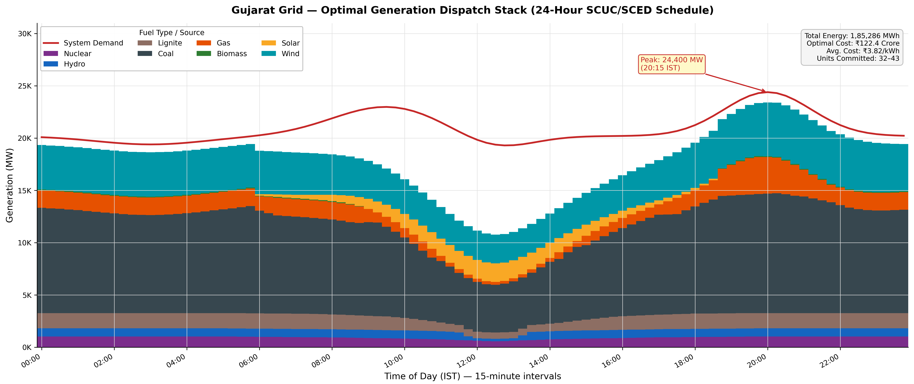
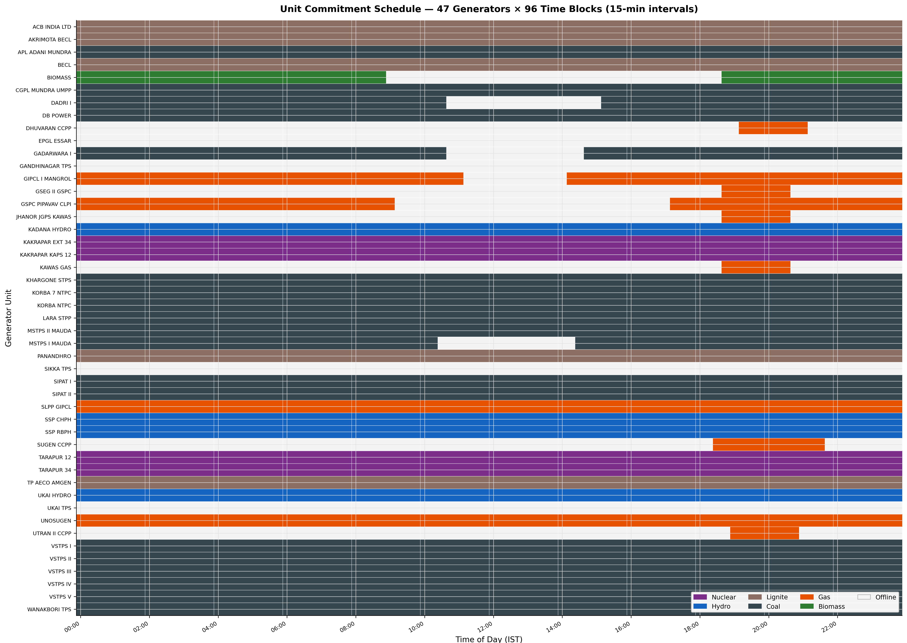
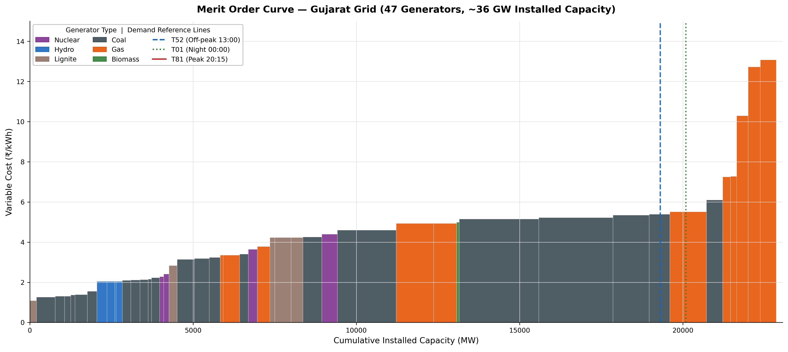
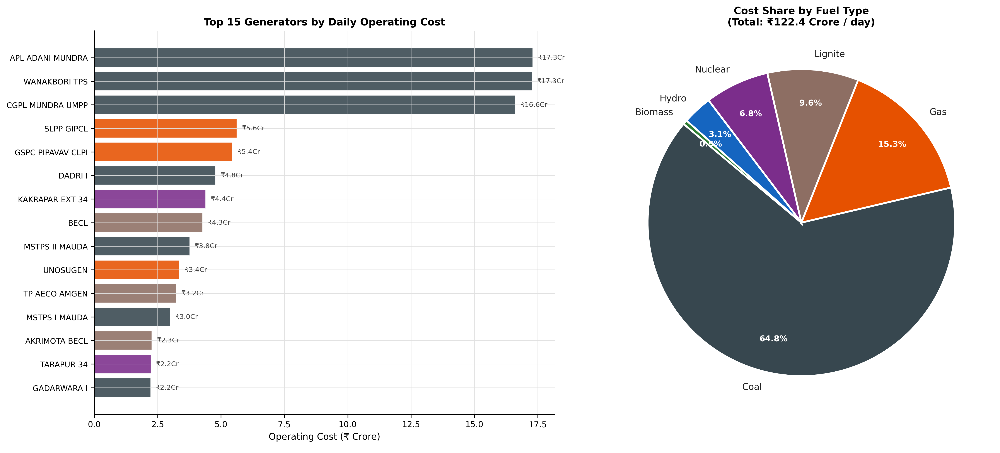
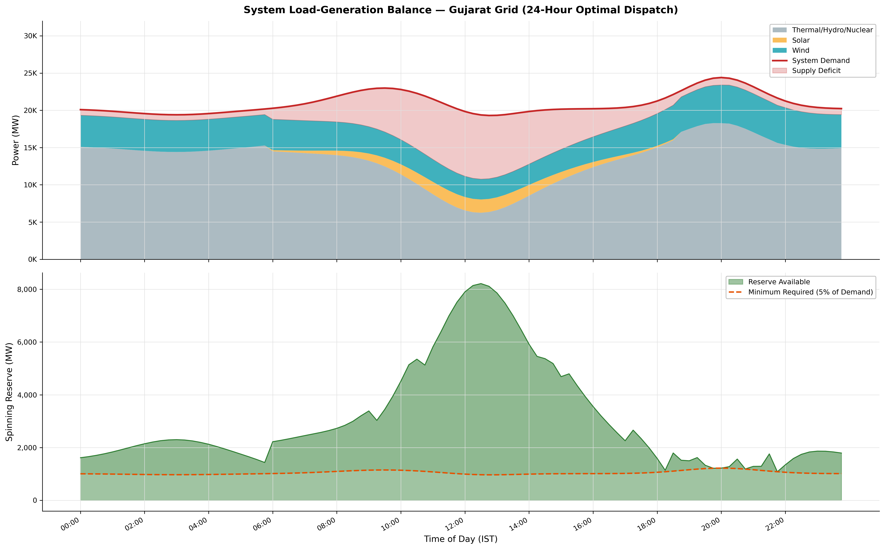
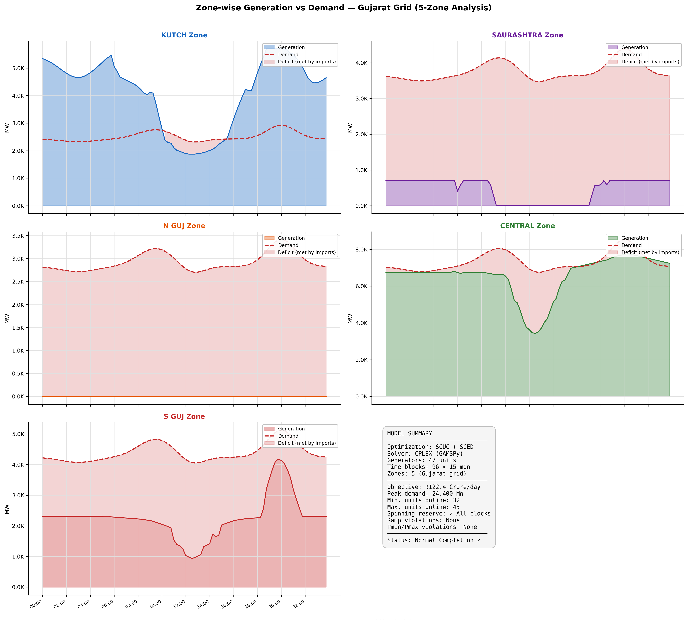

# Gujarat SLDC — SCUC/SCED Optimization Model

Security Constrained Unit Commitment & Economic Dispatch (SCUC/SCED) optimization model for the **Gujarat State Load Despatch Centre (SLDC)** grid, developed using GAMSPy and CPLEX solver.

---

## Key Results

| Metric | Value |
|--------|-------|
| Optimal Daily Cost | **Rs 122.4 Crore** |
| Average Variable Cost | Rs 3.82 / kWh |
| Peak Demand | 24,400 MW |
| Generators Modelled | 47 units |
| Time Blocks | 96 × 15-min (full 24 hrs) |
| Transmission Zones | 5 (Kutch, Saurashtra, N.Guj, Central, S.Guj) |
| MIP Variables | 13,489 binary |
| Model Rows | 32,406 |
| Optimality Gap | ≤ 0.1% |
| RE Curtailment | **Zero** |

---

## What This Model Does

This model answers the core question every grid operator faces daily:

- Which power plants should be **started up or shut down** over the next 24 hours?
- How much power should each running plant generate in each **15-minute block**?
- How much power should flow **between zones** to balance supply and demand?
- What is the **minimum cost** to reliably serve the entire state demand?

---

## Model Formulation

**Problem Type:** Mixed Integer Linear Program (MILP)

### Objective Function
Minimize total operating cost:
- Variable generation cost (Rs/kWh)
- No-load cost for committed units
- Startup costs per event
- Unserved energy penalty (VOLL = Rs 50,000/MWh)

### Constraint Families (10 total)

| # | Constraint | Count |
|---|-----------|-------|
| 1 | Power Balance (zonal) | 480 |
| 2 | Maximum Generation | 4,512 |
| 3 | Minimum Generation | 4,512 |
| 4 | Ramp Up Limit | 4,465 |
| 5 | Ramp Down Limit | 4,465 |
| 6 | Startup/Shutdown Logic | 4,465 |
| 7 | Minimum Up Time (MUT) | 4,465 |
| 8 | Minimum Down Time (MDT) | 4,465 |
| 9 | Spinning Reserve (≥5%) | 96 |
| 10 | Flow Antisymmetry | 480 |

---

## Generator Portfolio

| Fuel Type | Units | Total Capacity |
|-----------|-------|----------------|
| Coal | 14 | ~18,200 MW |
| Gas/CCPP | 12 | ~6,700 MW |
| Lignite | 5 | ~1,460 MW |
| Hydro | 4 | ~779 MW |
| Nuclear | 4 | ~1,035 MW |
| Biomass | 1 | ~82 MW |

---

## Technology Stack

| Component | Tool |
|-----------|------|
| Optimization Language | GAMS 53.5.1 + GAMSPy 1.23.1 |
| MIP Solver | CPLEX (IBM) |
| Programming Language | Python 3.13 |
| Data Processing | Pandas + NumPy |
| Visualization | Matplotlib |

---

## Data Sources

- **Generator Capacities:** CEA Installed Capacity Reports 2024–25
- **Variable Costs:** CERC Annual Fixed/Variable Charge Orders
- **Ramp Rates:** Indian Electricity Grid Code (IEGC) 2010
- **Demand Profile:** Gujarat SLDC published load data (summer 2024, ~24,400 MW peak)
- **Solar/Wind Profiles:** GERMI, NRSC/IMD irradiance maps
- **Transfer Limits:** GETCO 400kV/220kV corridor capacities

---

## Output Files

- `Gujarat_SCUC_Results.xlsx` — 9 sheets: Dispatch, Commitment, Costs, Flows, RE Curtailment
- `Fig1_Dispatch_Stack.png` — 24-hour generation stack chart
- `Fig2_Commitment_Heatmap.png` — 47×96 unit commitment heatmap
- `Fig3_Merit_Order.png` — Merit order curve with demand intersections
- `Fig4_Cost_Breakdown.png` — Top 15 generators + fuel-wise cost pie
- `Fig5_System_Metrics.png` — Load-generation balance + spinning reserve
- `Fig6_Zonal_Analysis.png` — 5-zone supply/demand analysis

---

## Visualizations

### Fig 1 — 24-Hour Generation Dispatch Stack

### Fig 2 — Unit Commitment Heatmap (47 × 96 blocks)

### Fig 3 — Merit Order Curve

### Fig 4 — Cost Breakdown by Generator

### Fig 5 — System Metrics (Load vs Generation)

### Fig 6 — Zonal Analysis

## Developed By

**Surjeet Chauhan** | Certified Energy Manager | June 2026  
Academic Licence: GAMSPy Academic Network GPA112384
